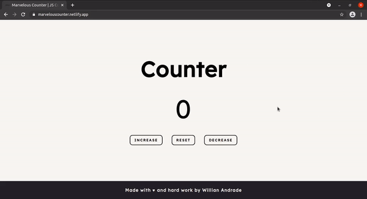

<h1 align="center">
  Marvelous Counter | Simple JS Counter ⚖️
</h1>

<p align="center">
  
</p>

## 🔧 Technologies

This project was developed using the following technologies:

**- JavaScript**

**- HTML5** 

**- CSS3**

And hosted using:

**- [Netlify](https://www.netlify.com/)**

## 💻 Getting Started

You can tweak as much as you like on your own by simply cloning the project to your machine:

```bash
$ git clone https://github.com/Will-Andrade/marvelous-counter.git && cd marvelous-counter
```

## 📚 Project

I made this project on my own to practice basic DOM Interactions and layout using JavaScript, HTML and CSS.

## ✍️ What I've Learned

1. Center content trick using ```display: grid;```.
2. How easy it is to create a counter with JavaScript and change it's color based on its current value.
3. How to create CSS variables.
4. Upgraded my Flexbox layout creation.

## 📖 Future To-dos

1. Make it responsive.

<p align="center">Made with :heart: and Hard Work by <a href="https://github.com/Will-Andrade">Willian Andrade</a></p>
